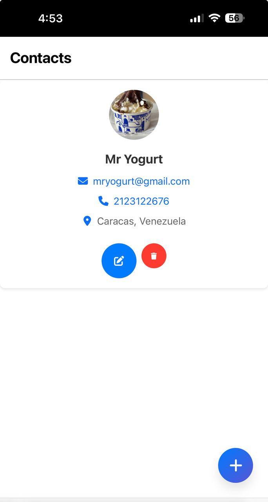

# Contact Manager Project with API Integration

> A modern React-based contact management application that helps you organize and manage your contacts efficiently. Built with React 18, featuring real-time API synchronization, responsive design, and intuitive user interface.

[](https://reactjs.org/)
[](LICENSE)
[](https://nodejs.org/)

**Keywords:** Contact Manager, React, API Integration, Contact Management, CRUD Application, React 18, Frontend Development, Contact List, Contact Organizer

## Screenshot



## Table of Contents

- [Features](#features)
- [Tech Stack](#tech-stack)
- [Prerequisites](#prerequisites)
- [Installation](#installation)
- [Usage](#usage)
- [API Documentation](#api-documentation)
- [License](#license)

## Features

- Create new contacts with detailed information (name, email, phone, address)
- View all contacts in a clean, organized list
- Update existing contact information
- Delete contacts with confirmation modal
- Upload and manage contact photos
- Contacts are synchronized with a backend API
- Responsive layout optimized for both desktop and mobile views
- User-friendly interface with a modern design
- Form validation for all input fields
- Loading states and error handling
- Accessibility features for better user experience

## Tech Stack

- **Frontend:**

  - React 18.2.0
  - React Router for navigation
  - CSS3 for styling
  - Axios for API calls

- **Development Tools:**
  - npm for package management
  - Git for version control
  - VS Code (recommended IDE)

## Prerequisites

- [Node.js](https://nodejs.org/) (version 14.X.X or higher)
- npm (included with Node.js)

## Installation

To get started, follow these steps:

1. Clone this repository:
   ```sh
   git clone https://github.com/dantefasano/contact-manager.git
   ```
2. Install the project dependencies:
   ```sh
   cd contact-manager
   npm install
   ```
3. Run the development server:
   ```sh
   npm start
   ```
4. Open your browser and navigate to http://localhost:3000 to view the application.

## Usage

After opening the Contact Manager app in your browser, you'll be presented with a modern, intuitive interface. You can:

- View all your contacts in a clean list format
- Add new contacts by clicking the "+" button and filling out the contact form
- Edit existing contacts by clicking the edit icon
- Delete contacts by clicking the trash icon (with confirmation)
- Upload contact photos
- View contact details including email, phone, and address
- Click on email addresses to open your email client
- Click on phone numbers to initiate calls

## API Documentation

This project uses the 4Geeks Academy Contact API:

- Base URL: https://playground.4geeks.com/contact
- Endpoints:
  - GET /agendas/{agenda_slug}/contacts - Get all contacts
  - POST /agendas/{agenda_slug}/contacts - Create a new contact
  - PUT /agendas/{agenda_slug}/contacts/{contact_id} - Update a contact
  - DELETE /agendas/{agenda_slug}/contacts/{contact_id} - Delete a contact

For more detailed API documentation, visit: https://playground.4geeks.com/contact/docs

## License

This project is licensed under the MIT License. See the [LICENSE file](LICENSE) for more details.

---

Made with ❤️ by [Dante Fasano](https://github.com/dantefasano/)
